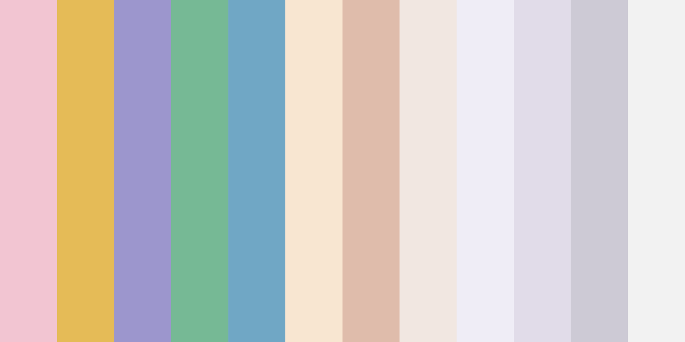

<center></center>

# paper-colors

A set of 12 paper colors from various brands.

This was sourced manually and by eye, so all colours are approximate, and the list is not exhaustive in any way. The colors are subject to change (PRs welcome!).

```js
const paperColors = require('paper-colors');

// Select a random color
const color = paperColors[Math.floor(Math.random() * paperColors.length)];

// Get the hex code e.g. '#e5bb57'
console.log(color.hex);
```

Each color object has the following format:

```js
{
  "name": "Canary",
  "hex": "#e5bb57",
  "brand": "Springhill Opaque"
}
```

## Install

Use [npm](https://npmjs.com/) to install.

```sh
npm install paper-colors --save
```

## Usage

The module exposes a JSON file as its entry point, which includes an array of colour objects.

## Sourcing

Most of the data has been manually sourced from [Vide Press](https://videpress.ca/) and its promotional photographs.

PRs welcome for more accurate and exhaustive data.

## License

MIT, see [LICENSE.md](http://github.com/mattdesl/paper-colors/blob/master/LICENSE.md) for details.
